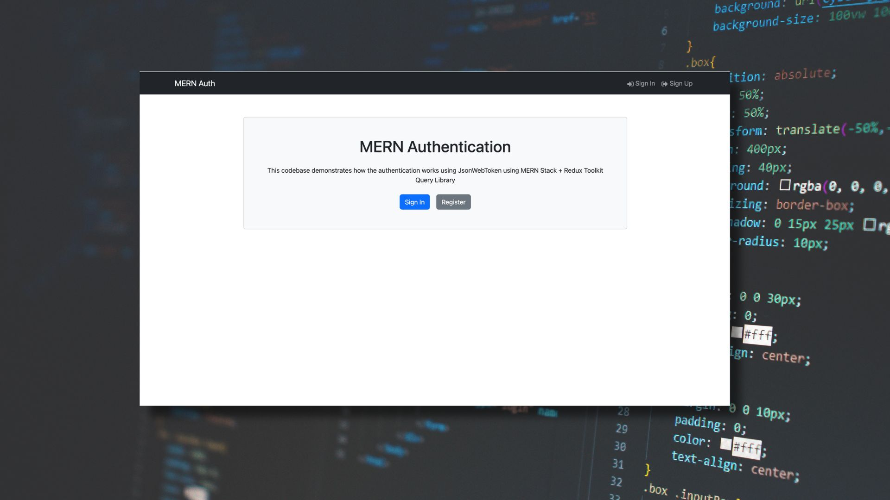

# MERN Authentication Project

This is a starter app for a MERN Stack application with authentication. It uses the Vite build tool for bundling the application.



## Features

- **Backend API:** Built with Express & MongoDB.
- **Routes:** Includes endpoints for auth, logout, register, profile, and update profile.
- **JWT Authentication:** Uses HTTP-only cookies to store the JWT.
- **Protected Routes:** Implements middleware to secure routes and endpoints.
- **Auth Middleware:** Checks the JSON Web Token and stores it in a cookie.
- **Error Handling:** Custom error middleware.
- **React Frontend:** Allows users to register, login, logout, view and update user profile.
- **UI Library:** Utilizes React Bootstrap.
- **Notifications:** Provides user feedback with React Hot Toast.
- **Standardized API Response:** Utilized standardized `APIError` and `APIResponse` classes for consistent error and response handling
- **Security Mitigations:** Utilizes various security focused npm packages like helmet, cors, express-rate-limiter, hpp etc.

## Usage

### Prerequisites

- **MongoDB:** Either a local MongoDB Community server or a MongoDB Atlas account.
- **Node.js:** Ensure you have Node.js installed on your system.

### Environment Variables

Rename the provided `.env.sample` file to `.env` and populate your data:

```txt
NODE_ENV=production
PORT=5009
MONGO_URI=<Add YOUR MONGO DATABASE URL HERE>
JWT_SECRET_KEY=<Your JWT TOKEN SECRET KEY HERE>
JWT_EXPIRY=<ADD YOUR JWT TOKEN EXPIRY TIME HERE e.g. 1d, 10d etc.>
CLIENT_URL=<Your Clients Frontend URL>
```

You can generate a secure JWT Secret Key using:

```bash
node -e "console.log(require('crypto').randomBytes(32).toString('hex'))"
```

Paste the generated string into `JWT_SECRET_KEY` for signing and verifying your JWT tokens.

---

## Installation

1. **Clone the repository.**
2. Run the build command:

   ```bash
   npm run build
   ```

3. **Development Mode:** Run both the frontend and backend servers:

   ```bash
   npm run dev
   ```

   **Or**
   **Backend Only:** Start just the backend server:

   ```bash
   npm run server
   ```

---

## Application Flow

1. **State Management:**  
   Uses Redux Toolkit Query for state management. Initially, the state is empty, and the user is **NOT** logged in.

2. **Registration Flow:**  
   - Collect user information (name, email, and password) from the frontend.
   - Validate empty fields and verify that the email is valid.
   - Ensure the user **does not** already exist.
   - Create a new user account in the database.
   - Redirect the user to the login page upon successful registration.

3. **Login Flow:**  
   - Collect user information (email and password) from the frontend.
   - Validate empty fields and verify that the email is valid.
   - Ensure the user exists.
   - Fetch the user from the database.
   - Validate the hashed password using bcryptjs.
   - Generate a JWT payload using the user's ID, role, and email.
   - Save the JWT token to an HTTP-only cookie.
   - Return the response and store the user info in localStorage.
   - Redirect the user to the home screen.

4. **Protected Routes:**  
   The frontend uses a `ProtectedRoute` element. If no user is detected, the user is redirected back to the login page.

### Security Implementations

This Codebase utilize a few security measures to protect the application from various commonly known attacks.

#### 1. Express Rate Limiter

 This package implements a basic rate limiter that prevents multiple simultaneuos requests from a single IP, hence providing protection against brute force attacks.

 ```js
app.use(
  rateLimit({
    windowMs: 15 * 60 * 1000,
    limit: 100,
    legacyHeaders: false,
    message: 'Too many requests from this IP. Please try after sometime.',
  })
);
 ```

#### 2. CORS

 CORS comes from "Cross-Origin resource sharing" and is, basically, a protocol that allows or not a server to acess your website resources (routes data, api requests etc).

 ```js
app.use(
  '/api',
  cors({
    origin: process.env.CLIENT_URL || 'http://localhost:5173',
    credentials: true,
    methods: ['GET', 'POST', 'PUT', 'DELETE', 'PATCH', 'OPTIONS', 'HEAD'],
    allowedHeaders: [
      'Content-Type',
      'Authorization',
      'X-Requested-With',
      'device-remember-token',
      'Access-Control-Allow-Origin',
      'Origin',
      'Accept',
    ],
  })
);
 ```

#### 3. Helmet

Helmet Help secure Express apps by setting HTTP response headers.

```js
import helmet from "helmet";

const app = express();

app.use(helmet());
```

### License

```txt
MIT License

Copyright (c) 2025 Manmeet Singh

Permission is hereby granted, free of charge, to any person obtaining a copy
of this software and associated documentation files (the "Software"), to deal
in the Software without restriction, including without limitation the rights
to use, copy, modify, merge, publish, distribute, sublicense, and/or sell
copies of the Software, and to permit persons to whom the Software is
furnished to do so, subject to the following conditions:

The above copyright notice and this permission notice shall be included in all
copies or substantial portions of the Software.

THE SOFTWARE IS PROVIDED "AS IS", WITHOUT WARRANTY OF ANY KIND, EXPRESS OR
IMPLIED, INCLUDING BUT NOT LIMITED TO THE WARRANTIES OF MERCHANTABILITY,
FITNESS FOR A PARTICULAR PURPOSE AND NONINFRINGEMENT. IN NO EVENT SHALL THE
AUTHORS OR COPYRIGHT HOLDERS BE LIABLE FOR ANY CLAIM, DAMAGES OR OTHER
LIABILITY, WHETHER IN AN ACTION OF CONTRACT, TORT OR OTHERWISE, ARISING FROM,
OUT OF OR IN CONNECTION WITH THE SOFTWARE OR THE USE OR OTHER DEALINGS IN THE
SOFTWARE.
```